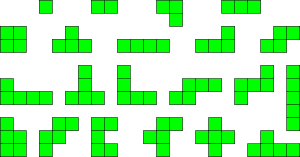
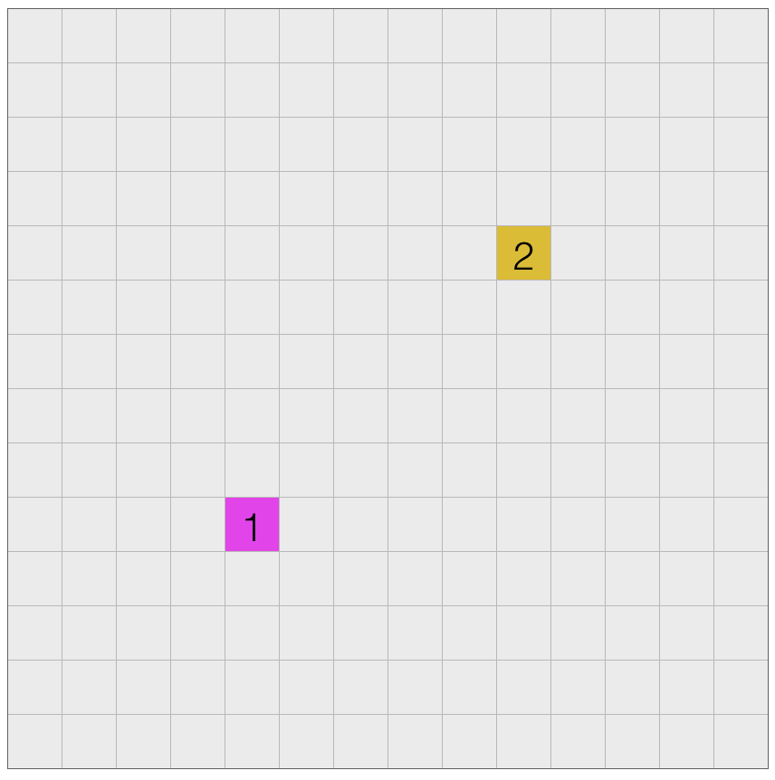
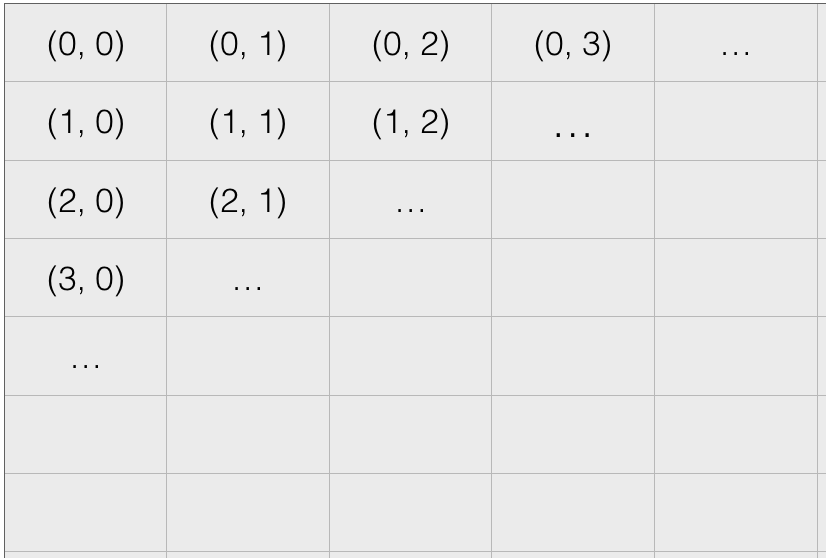

# BlokusHacker

> 角斗士棋的AI

***不断更新中……***

[角斗士棋](http://www.mattelgames.com/en-us/blokus/index.html) 是[Bernard Tavitian](https://en.wikipedia.org/wiki/Blokus#cite_note-2)发明的一种供2至4人游戏的抽象策略类桌游。最早于2000年由法国企业Sekkoïa发行。角斗士棋曾获得过包括国际游戏节门萨奖及2004年度教师选择奖等很多奖。

*图片取自 http://www.mattelgames.com*

角斗士棋AI比赛是为中国科大学生举办的比赛，我们希望参赛选手设计出多种多样的AI程序，胜利不是比赛的唯一评价标准。
主办方将会为各个选手的AI提供相互PK的平台（后面会更新）。

**当然，我们也欢迎“高级软件测试工程师”，到现场和AI对战也可能获得奖励哦！**我们也欢迎您提问有关AI的问题。

## 规则与限制

为了公平起见，比赛采取1对1的方式进行，并且棋盘大小为14\*14（我们放弃了20\*20的棋盘，因为代价过高）

角斗士棋的棋盘分为14行14列总共196小格。2个玩家分别执黄色紫色棋子，每位玩家的棋子有21种。每个棋子由1到5个方块组成（包括1个单方块的，1个双方块的，2个三方块的，5个四方块的和12个五方块的）

角斗士棋14\*14棋盘规则如下：

* 两位玩家各执一色，轮流落子，先手会由服务端仲裁决定
* 每位玩家的第一颗子需要覆盖一个特殊位置（图中有标示）。玩家落子时，同颜色棋子的方块只能角对角相连，不能边对边。不同颜色的可以任意相邻。
* 当某一个玩家无棋可下时，直接跳过该玩家，游戏正常进行（可以证明落子比不落子是更优的）。当所有玩家都无棋可下时，游戏结束

因为简单暴力搜索的复杂度大约在10^74~10^100，所以你需要适当进行优化，或者不进行全部的搜索。

**棋盘上的坐标规定：**

**以下是优胜者的标准（可选）：**

* 在给定充足思考的时间下获取最高分（比如每步30秒）
* 在非常有限的思考时间下获取最高分（比如每步1秒）
* 不预先训练，不预先搜索
* 可拓展性（大多搜索方法不满足可拓展性）
* 通过AI的行为分析出如何是优势（通过AI总结出经验）

达到以上标准一项或几项的都是值得称赞的

## 提示

下面给出一些思路

- 给出一个评分函数，对下一步或者更多步之后的棋局进行评分，然后选择一个评分最高的。（这样可以在很少步数内得到结果，当然效果取决于你的评分函数以及搜索深度）
- 棋局中会有很多状态是重复的：有时候两个棋子先后放置并不重要。查重后可以大幅降低搜索难度
- 你可以不对棋局进行评分，而是对你下的棋进行评分。（比如可以挡住对方角的得分高，下占5格的棋子比下占4格的得分高）
- 使用机器学习的方式

##示例程序

示例程序采用Python语言，因为python相对于C语言入门简单且非常方便。

我们将尽量采用Python3标准(最终代码都会被修改为Python3)。

如果你对Python了解不多，可以参考[教程](http://www.liaoxuefeng.com/wiki/0014316089557264a6b348958f449949df42a6d3a2e542c000)

###Blokus-0405.py

>更多细节请访问[BlokusHacker/Examples/site](Examples/site).

示例程序可以让你迅速的写出你自己的角斗士棋AI，代表AI水平的核心的功能是getScores。
如果你不想浪费时间在一些像rotate, canPut, getDiagList之类的基础功能上，我们欢迎你使用示例程序中的代码。
**:)**.

